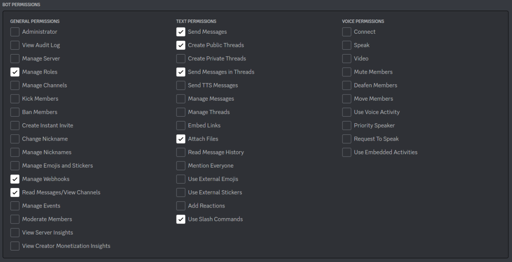

# P4DC
- P4DC integrates Perforce servers running on Linux with your Discord server
  - One channel can be dedicated to one repository, there can be multiple P4DC-binded channels in one server
  - Communication happens via [triggers](https://www.perforce.com/manuals/p4sag/Content/P4SAG/chapter.scripting.html) from Perforce to Discord, and never the other way around
- Relevant commit messages can be marked as **pull requests**
  - You can change default pull request contents per channel

[](/res/flow.png)

## Setup
- Invite the bot to your server using [this link](https://discord.com/api/oauth2/authorize?client_id=1067966552068079616&permissions=312190471168&scope=bot)
- Your server must use a [ticket-based](https://www.perforce.com/manuals/p4sag/Content/P4SAG/superuser.basic.auth.tickets.html) login policy
  - Official document describing how to change security level [here](https://www.perforce.com/manuals/v20.1/p4sag/Content/P4SAG/security-levels.html)
  - There must be a valid ticket at `/opt/perforce/p4dc_ticket`, otherwise an error will show on trigger that describes how to create that ticket
- Your own computer must be able to extract `.tar.gz` archives (on Linux this can be done with `tar`, on Windows WinRAR supports the format)
  
## Commands
- `/route_here`: create a `P4DCReviewer` role that will be pinged on pull requests, as well as a `P4DCHook` webhook
  - *CAUTION: This webhook is currently stored as plain text on P4DC's server*
- `integration_help <depot name>`: generate trigger scripts and installation instructions
  - If your depot is directly under your server root address (*ex.* `//MyDepot/`), just fill in the depot's name (*ex.* `/integration_help MyDepot`)
  - If your depot is under some hierarchy, then fill in all the *middle* slashes (*ex.* for `//CompanyA/MyGame` do `/integration_help CompanyA/MyGame`)
- `set_pr_defaults`: set default contents that will show up when someone tries to make a pull request in your channel
  - You can add HTML comments that will disappear in the actual pull request just like on Github
  - *ex.*
    ```
    Related Task:
    <!--tag the Trello card here-->
    ```
    - If the pull requester does not delete the comment manually, it will be automatically deleted by P4DC
    
## Pull Requesting
- For commit messages from `P4DC Buddy`, you can right click the message and select `Apps/pull_request` to make a pull request
- P4DC will create a thread with the appropriate title and ping everyone with the `P4DCReviewer` role

# Building the Bot Yourself
## Setup
- [DPP dependency](https://dpp.dev/)
- Install dependencies
  - In the libs folder there is a `clone.sh` script to run for convenience
- Create the build folder with `mkdir -p build && cd build`
- Install CMake and do `cmake ..`, `cmake --build .`

## Running
- Register for an application on Discord and use these bot permissions:
  
- The bot must also have relevant `intent` set for reading message content (*this is only for examining the content of messages from webhooks created by the bot itself*)
- Make sure you filled the environment variables with your bot (see `env.h.template`)
- Build and run `./p4dc` under the `build` folder

## Info
- P4DC is developed by [Alan Tao](https://alanrtao.com) independent from Perforce Helix Core
