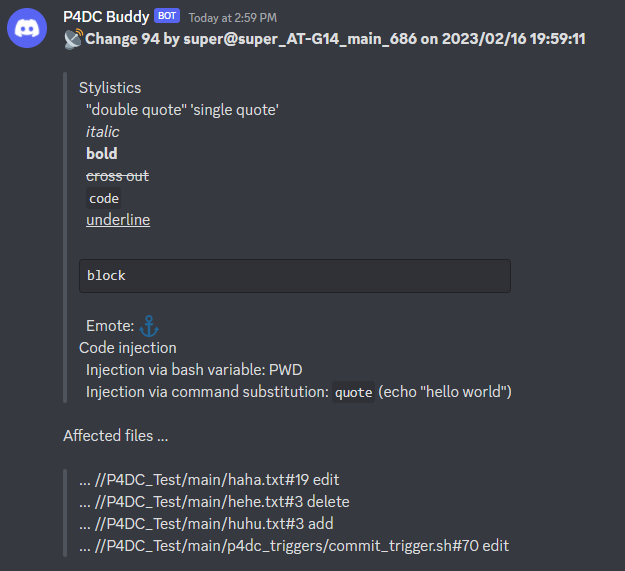

# P4DC
## What?
- P4DC is a Discord integration for Perforce. It generates Bash scripts based on information you provide, which can be used as [triggers](https://www.perforce.com/manuals/p4sag/Content/P4SAG/chapter.scripting.triggers.html)
- You can view commit messages in designated channels
  
- You can create threads by including `#PR` in your [changelist description](https://www.perforce.com/manuals/p4v/Content/P4V/files.submit.html#Submit_changelists). The thread's name can be specified after `#PR`
  
## How?
- The bot consists of two commands, `route_here` and `integration_help`
- `route_here` sets up
  - A [webhook](https://support.discord.com/hc/en-us/articles/228383668-Intro-to-Webhooks) that allows Perforce triggers to communicate with the channel
  - A reviewer role that you can assign to members of your server
  
  
- `integration_help`
  - Sends you a compressed archive containing relevant Bash scripts
    - *Caution: these scripts include information regarding your Discord channel's webhook, which may be used by others to send spam to that channel. Please do not share the files with people you do not trust.*
    - *Caution: these scripts are meant to be run on the machine that hosts your Perforce server. They come with no warranty against side effects or unintended consequences, please beware and: 1) inspect the scripts before use; 2) only choose scripts you need; 3) inform the owner of that machine if it is not you*.
  - Generates instructions to set up the Perforce server and the machine that hosts it, including the creation of relevant **user groups** and **login tickets**
    - *Caution: please be sure to check against your organization's policies on security and privacy when following these steps*
    - You will encounter steps that *require* ownership of the machine hosting the Perforce server. In such case, please contact the owner to complete these steps instead of working around them.
  - If you do not trust such a method, feel free to fill out the [Bash scripts](res/templates) with your variables
    - You are required to create a separate webhook as P4DC's webhook might not have a visible URL
    - P4DC will check that the sending user is named "P4DC Buddy". Please ensure this is kept in your edited scripts.

## Where?
- Invite the bot to your server using [this link](https://discord.com/api/oauth2/authorize?client_id=1067966552068079616&permissions=312190471168&scope=bot)
- View additional Perforce articles at [my website](https://alanrtao.com/#perforce)

## Who?
- P4DC is developed by Alan Tao independent from Perforce Helix Core

# Building the Bot Yourself
## Setup
- [DPP dependency](https://dpp.dev/buildcmake.html)
- Install dependencies (in the libs folder there is a `clone.sh` script to run, you can also just clone the DPP repository under `libs`)
- `mkdir -p build && cd build`
- Install CMake and do `cmake ..`, `cmake --build .`

## Running
- Register for an application on Discord and use these bot permissions:
  
- The bot must also have relevant `intent` set for reading message content (*this is only for examining the content of messages from webhooks created by the bot itself*)
- Make sure you filled the environment variables with your bot (see `env.h.template`)
- Build and run `./p4dc` under the `build` folder
